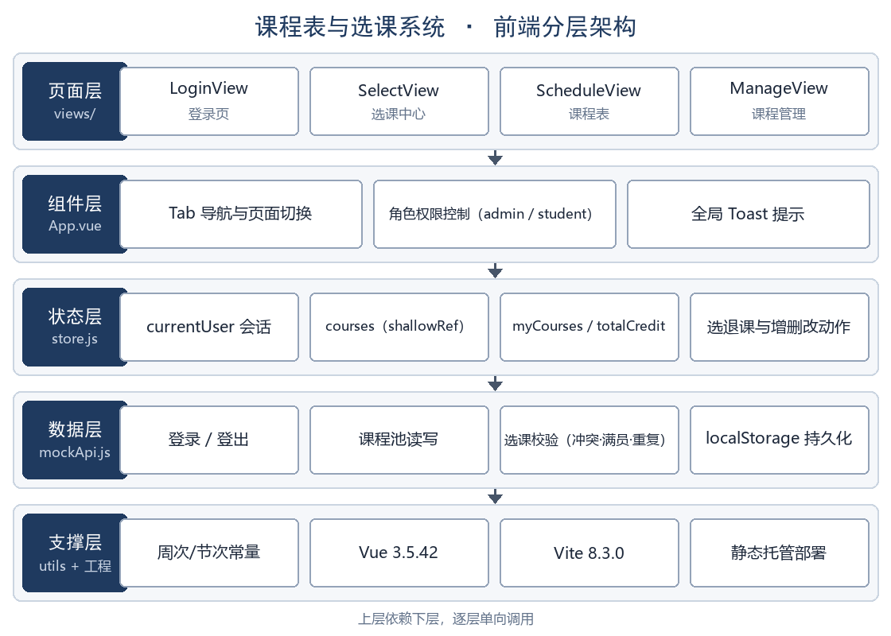
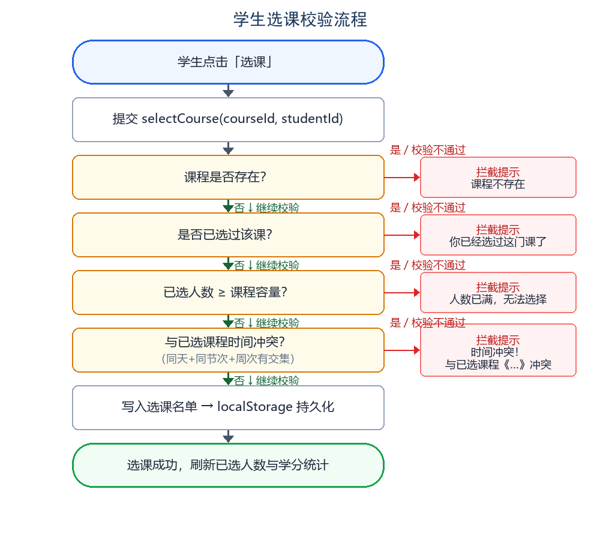

# 《Web开发实践》学生提交材料

**课程表与选课系统（Web 前端版）**

课程号：07100130　　学分：1　　总学时：1周

面向专业：计算机科学与技术

适用学期：2026—2027 学年第一学期

指导教师：________

学号/姓名：________ / ________

2026 年 9 月

## 目　录

一、个人任务与进度登记表

二、环境配置文档

三、可行性分析报告

四、架构设计文档（含页面结构图/模块设计图）

五、每日开发记录

六、代码库（含版本管理记录）

七、代码运行说明

八、功能演示视频

九、答辩材料（PPT 等）

十、技术复盘报告

十一、课程实践报告

## 一、个人任务与进度登记表

个人任务与进度登记表用于向教师登记个人基本信息、选题与开发计划，是个人任务组织与过程考核的基础材料。本课程不分组，学生以单人方式独立完成。

**表1　个人任务信息**

| 项目 | 内容 |
| --- | --- |
| 学号/姓名 | ________ / ________ |
| 专业班级 | ________ |
| 选题名称 | 课程表与选课系统（Web 前端版） |
| 选题类别 | Vue 单页面应用类（Vue 3 组件化应用） |
| 代码仓库地址 | 尚未创建，补齐步骤见「六、代码库」 |
| 部署访问地址 | 尚未部署，部署步骤见「七、代码运行说明」 |
| 技术栈 | HTML5 + CSS3 + JavaScript + Vue 3.5.42（Vite 8.3.0 脚手架） |

**表2　个人开发计划**

| 时间 | 个人任务 | 预期产出 |
| --- | --- | --- |
| 第1天 | HTML/CSS/JavaScript 基础学习与交互练习；Vite 创建 Vue 项目脚手架 | 静态页面骨架、环境配置文档 |
| 第2天 | 登录认证与全局状态模块开发；全局样式与 Toast 提示实现 | 登录页、状态层 store.js、每日开发记录 |
| 第3天 | 选课中心与课程表页面组件化开发；选课校验逻辑实现 | 选课页、课表页、每日开发记录 |
| 第4天 | 管理员课程管理模块开发；AI 开发工具辅助缺陷排查与综合集成 | 管理页、综合项目、代码库 |
| 第5天 | 环境验证与功能测试、补齐版本管理与部署、演示录制与报告撰写 | 验证记录、演示视频、复盘报告、实践报告 |

【填写要点】单人完成意味着全部环节由自己负责，任务计划应覆盖「学习—开发—验证—部署—演示—报告」全流程并预留缓冲；上表第 1—5 天为计划框架，具体日期按本人实际开发记录填写。

## 二、环境配置文档

环境配置文档记录开发与部署环境的搭建全过程，要求步骤清晰、可复现，做到「换一台机器也能按文档搭出同样环境」。

### （一）运行环境

**表3　运行环境**

| 项目 | 内容 |
| --- | --- |
| 操作系统 | Windows 11 Home China（10.0.26200，64 位） |
| 开发工具 | VS Code（项目推荐扩展为 Vue.volar，见 .vscode/extensions.json） |
| 运行环境 | Node.js v25.2.1、npm 11.6.2 |
| 版本要求 | package.json 中 engines 声明 node ^22.18.0 或 >=24.12.0，当前版本满足 |
| 框架与脚手架 | Vue 3.5.42、Vite 8.3.0、@vitejs/plugin-vue 6.0.8 |
| 辅助插件 | vite-plugin-vue-devtools 8.2.1（已在配置中启用，用于组件状态调试） |
| AI 开发工具 | 千问工作助理（代码检查、错误定位、运行时验证） |
| 版本管理 | 尚未配置，补齐步骤见「六、代码库」 |

### （二）安装与配置步骤

```bash
# 1. 安装 Node.js（官网下载 LTS 或更新版本，安装时勾选 Add to PATH）
# 2. 验证 Node 与 npm
node -v        # 本机实测输出 v25.2.1
npm -v         # 本机实测输出 11.6.2
# 3. 进入项目目录并安装依赖
cd course-system
npm install
# 4. （补齐版本管理时执行）配置 Git
git config --global user.name "你的姓名"
git config --global user.email "你的邮箱"
```

### （三）启动方式

```bash
npm run dev      # 浏览器访问 http://localhost:5173 即启动成功
npm run build    # 构建产物输出到 dist/ 目录
npm run preview  # 本地预览构建结果
```

实测说明：若 5173 端口被其他进程占用，Vite 会自动递增端口（本机实测自动切换至 5174），也可在 vite.config.js 的 server.port 中修改或先释放端口。

### （四）配置中遇到的问题与解决

**表4　问题与解决记录**

| 问题描述 | 原因分析 | 解决方式 |
| --- | --- | --- |
| 启动后页面白屏，控制台无应用挂载痕迹 | src/main.js 被误写为 Vite 构建配置，缺少 createApp 挂载代码 | 将 main.js 改写为应用入口 createApp(App).mount('#app')，原配置迁移至 vite.config.js |
| 页面空白，Network 中无 main.js 请求 | index.html 缺少入口脚本引用 | 在 body 末尾补加 script type="module" src="/src/main.js" |
| 运行报模块解析失败（Failed to resolve import） | mockApi.js 与三个视图引用 ../utils.js，实际文件名为 util.js | 将 util.js 重命名为 utils.js，与全部四处引用对齐 |
| 界面无任何样式 | assets/main.css 未被任何文件引入 | 在 main.js 中补加 import './assets/main.css' |
| 开发服务器未监听 5173 | 本机另一进程占用 5173 端口 | Vite 自动切换至 5174；或释放端口后重启 |

### （五）环境验证

验证方式与实测结果：执行 npm run dev 后开发服务器正常启动，对首页与入口模块的请求均返回 HTTP 200；各视图模块（LoginView、SelectView、ScheduleView、ManageView）与工具模块均能正确编译返回。另执行运行时验证 20 项全部通过，覆盖登录、错误密码拒绝、课程池加载、选课、重复选课拦截、时间冲突拦截、满员拦截、退课、课程新增/编辑/删除，详见「十一、课程实践报告」第 6 节测试用例表。以上结果即视为环境配置成功；部署环境验证待按「七、代码运行说明」完成部署后补充。

【填写要点】安装命令、版本号必须与实际一致；问题与解决记录是过程考核「工具熟练度」的重要证据，表 4 为本项目真实修复记录，可直接采用。

## 三、可行性分析报告

可行性分析报告围绕选题分析需求，完成功能架构构想与技术/工具选型，并针对复杂工程问题约束条件开展可行性分析。

### （一）需求分析

功能需求：系统面向高校选课与课表查询场景，以 Web 网页形式提供用户登录（学生/管理员双角色）、选课中心（课程检索、选课、退课、容量与冲突校验）、我的课程表（按周视图展示、周次切换、课表文本导出）、课程管理（管理员新增/编辑/删除课程）与全局提示等功能。

非功能需求：页面在主流浏览器（Chrome、Edge、Firefox、Safari）下布局与交互正常；课程列表在数据量增大时检索仍流畅；数据本地化存储于浏览器，不涉及外部敏感数据；管理功能仅管理员角色可见可操作。

### （二）总体方案构想

技术路线：HTML5 + CSS3 + JavaScript（基础）＋ Vue 3 + Vite（框架与脚手架）＋ 静态托管平台（部署，待实施）。

选型理由：Vue 3 组合式 API 与组件化开发便于页面复用与维护，响应式系统可自动驱动课表与学分统计刷新[^vuedoc]；Vite 启动与构建速度快，适合 1 周实践周期[^vitedoc]；项目为纯前端单页应用，数据经 localStorage 本地持久化，静态托管即可上线，免服务器运维。

### （三）功能架构设计

**表5　功能模块划分**

| 模块 | 主要功能 |
| --- | --- |
| 登录认证模块 | 账号密码校验、登录会话保持（localStorage）、退出登录、表单非空校验 |
| 选课中心模块 | 课程列表展示、按名称/教师关键词检索（防抖）、选课、退课、容量与已选状态标识 |
| 我的课程表模块 | 按周网格渲染课表、周次切换、课程详情弹窗、课表文本导出 |
| 课程管理模块 | 课程新增、编辑、删除（仅管理员），表单校验与颜色配置 |
| 公共状态与数据模块 | 全局状态 store（用户、课程池、Toast）、模拟接口层 mockApi、周次节次常量 |

### （四）复杂工程约束可行性分析

跨浏览器兼容约束：采用标准化 CSS 与 Flex 布局，全局 reset 样式统一盒模型，媒体查询适配平板宽度；未使用实验性 CSS 特性，特性支持差异以 MDN 兼容性数据为准[^mdn]。以上措施技术可行。

性能约束：课程池使用 shallowRef 浅层响应，列表整体替换避免深度响应开销；检索输入做 300ms 防抖，减少无谓过滤计算；课表按当前周按需过滤渲染，控制 DOM 数量。以上措施可有效控制渲染开销，技术可行。

合规伦理约束：本系统为教学演示项目，课程、教师、账号均为虚构演示数据，不涉及真实个人信息与侵权资源，符合学术诚信要求。

AI 工具使用边界：AI 开发工具用于代码检查、错误定位与验证脚本编写；所有 AI 给出的修复均经本人逐条复核并运行验证（20 项运行时验证全部通过）后采纳，并在技术复盘中如实记录。

### （五）风险分析与应对

**表6　风险分析与应对**

| 风险 | 影响 | 应对措施 |
| --- | --- | --- |
| Vue 组合式 API 与响应式原理学习成本较高 | 影响功能完整性 | 先实现登录与列表核心页面，再扩展管理模块 |
| 功能点较多，一周内开发不完 | 影响功能完整性 | 按模块优先级开发：先选课/课表，后管理与导出 |
| 纯前端存储导致数据仅存于单机浏览器 | 多设备数据不一致 | 明确演示边界，后续接入后端 API 持久化 |
| 部署后刷新 404 或资源路径异常 | 线上访问异常 | 部署时配置 SPA 回退，构建前验证产物 |

### （六）个人进度计划

**表7　个人进度计划**

| 时间 | 任务 | 产出 |
| --- | --- | --- |
| 第1天 | 基础学习与脚手架搭建 | 静态页面、环境配置文档 |
| 第2天 | 登录认证与全局状态开发 | 登录页、store.js、每日开发记录 |
| 第3天 | 选课中心与课表页组件化开发 | 选课页、课表页、每日开发记录 |
| 第4天 | 课程管理模块开发与综合集成 | 综合项目、代码库 |
| 第5天 | 验证测试、版本管理、部署与报告 | 验证记录、演示视频、复盘报告、实践报告 |

【填写要点】约束条件必须落实到具体技术措施，不能只写「考虑兼容性」这类空话；风险与应对要针对本人实际情况。

## 四、架构设计文档（含页面结构图/模块设计图）

架构设计文档明确页面组成、组件划分、模块职责与依赖关系、路由与交互逻辑，并附模块设计图。

### （一）系统总体架构

系统采用前端分层结构：页面层（LoginView 登录页、SelectView 选课中心、ScheduleView 我的课程表、ManageView 课程管理）→ 组件层（根组件 App.vue 承担 Tab 导航与页面切换、角色权限控制、全局 Toast 提示）→ 状态层（store.js 维护 currentUser 会话、courses 课程池、myCourses 与 totalCredit 计算属性及选退课动作）→ 数据层（mockApi.js 模拟接口，含选课校验与 localStorage 持久化）→ 支撑层（utils.js 周次节次常量、Vue 3.5.42、Vite 8.3.0、静态托管部署）。分层设计使页面、状态与数据解耦，便于单人分阶段开发与后期维护。

### （二）模块划分与职责

**表8　模块职责**

| 模块 | 职责 | 依赖 |
| --- | --- | --- |
| 登录认证模块 | 登录校验、会话保持、退出登录 | store.js、mockApi.js、localStorage |
| 选课中心模块 | 课程展示、关键词检索、选课、退课 | store.js、mockApi.js 选课校验 |
| 我的课程表模块 | 周视图渲染、周次切换、详情弹窗、文本导出 | store.js、utils.js 常量 |
| 课程管理模块 | 课程新增/编辑/删除、表单校验 | store.js、mockApi.js |
| 公共状态模块 | 全局用户/课程池/Toast 状态与动作 | mockApi.js |

### （三）模块设计图

模块设计图如下，展示五层结构与各层核心单元，层间为单向依赖：



### （四）页面结构与切换

本项目未引入 vue-router，采用根组件条件渲染实现 Tab 切换：App.vue 依据登录态与当前 Tab 渲染对应视图，管理页额外受角色权限约束。该方案的取舍分析见「十、技术复盘报告」。

**表9　页面结构与切换条件**

| 页面 | 承载组件 | 显示条件 |
| --- | --- | --- |
| 登录页 | LoginView.vue | 未登录（currentUser 为空） |
| 选课中心 | SelectView.vue | 已登录且当前 Tab 为选课中心 |
| 我的课程表 | ScheduleView.vue | 已登录且当前 Tab 为课程表 |
| 课程管理 | ManageView.vue | 已登录、角色为 admin 且当前 Tab 为课程管理 |

### （五）关键业务流程

选课流程：学生点击选课 → 校验课程存在 → 校验未重复选课 → 校验课程未满员 → 校验与已选课程无时间冲突（同一天 + 同一节次 + 周次区间有交集）→ 写入选课名单并持久化 → 刷新已选人数与学分统计 → 提示选课成功。任一校验不通过即拦截并给出具体原因。



退课流程：确认弹窗 → 从课程选课名单移除该学生 → 持久化 → 刷新列表与学分统计。课程管理流程：管理员填写表单 → 校验名称/教师非空、开始周不大于结束周 → 新增或更新课程（编辑时保留已选名单）→ 刷新课程池。

【填写要点】模块设计图是架构设计的核心证据，图 1、图 2 均按本项目真实代码结构绘制，可配合文字说明独立理解。

## 五、每日开发记录

每日开发记录用于记录个人当日任务、完成情况、问题与解决过程及 AI 工具使用情况，是过程考核的重要证据。

**表10　每日开发记录**

| 日期 | 今日任务 | 完成情况 | 问题与解决 | AI工具使用 | 明日计划 |
| --- | --- | --- | --- | --- | --- |
| 第1天（按实际填写） | 基础学习；Vite 创建项目 | 完成；脚手架可用 | （按实际填写） | （按实际填写） | 登录与状态模块 |
| 第2天（按实际填写） | 登录认证与全局状态开发 | 完成；登录与会话可用 | （按实际填写） | （按实际填写） | 选课与课表页 |
| 第3天（按实际填写） | 选课中心与课表页开发 | 完成；选课校验生效 | （按实际填写） | （按实际填写） | 课程管理模块 |
| 第4天（按实际填写） | 课程管理模块与综合集成 | 完成；三角色流程贯通 | （按实际填写） | （按实际填写） | 验证与补齐材料 |
| 2026-09-11 | 项目环境检查与缺陷修复 | 完成；运行时验证 20 项全部通过 | 定位并修复三处白屏级缺陷：入口文件内容错误、index.html 缺少入口引用、工具模块文件名与引用不一致；另补齐全局样式引入 | AI 辅助代码检查、错误定位与 20 项运行时验证脚本编写，修复逐条人工复核 | 补齐版本管理与部署，录制演示视频 |

【填写要点】第 1—4 天为记录框架，请按本人真实开发日期与内容填写；2026-09-11 行为本项目已实际发生并验证的记录，可直接采用。问题与解决过程、AI 工具使用情况是技术复盘和课程报告的重要素材，测试数据（验证项数、缺陷数）建议一并记录。

## 六、代码库（含版本管理记录）

代码库用于提交完整可运行的项目代码，并通过版本管理记录体现开发过程与工具链使用痕迹。

### （一）仓库目录结构（当前真实结构）

```text
course-system/
├── index.html              # 入口 HTML（已补加 main.js 模块引用）
├── vite.config.js          # Vite 配置（插件、@ 别名、端口、产物目录）
├── package.json            # 依赖与脚本（engines 声明 Node 版本要求）
├── jsconfig.json           # 编辑器路径别名配置
├── public/
│   └── favicon.ico         # 站点图标
├── docs/                   # 文档与配图（本提交材料所在目录）
└── src/
    ├── main.js             # 应用入口（createApp 挂载 + 全局样式引入）
    ├── App.vue             # 根组件（Tab 切换、权限控制、Toast）
    ├── store.js            # 状态层（用户/课程池/计算属性/动作）
    ├── utils.js            # 周次、节次常量与命名函数
    ├── api/
    │   └── mockApi.js      # 模拟接口层（选课校验、localStorage 持久化）
    ├── views/
    │   ├── LoginView.vue   # 登录页
    │   ├── SelectView.vue  # 选课中心
    │   ├── ScheduleView.vue# 我的课程表
    │   └── ManageView.vue  # 课程管理（管理员）
    └── assets/
        └── main.css        # 全局样式
```

源码规模：10 个源文件，合计 597 行（不含依赖与构建产物）。

### （二）Git 提交历史（现状与补齐步骤）

如实说明：截至本材料提交时，项目目录尚未初始化 Git 仓库（无 .git 目录），因此暂无真实提交历史可附。补齐步骤如下，执行后即产生可核验的版本管理记录：

```bash
cd course-system
git init
git add .gitignore index.html package.json package-lock.json jsconfig.json vite.config.js src public docs README.md
git commit -m "feat: 课程表与选课系统完整功能（登录/选课/课表/管理）"
# 后续每次修改独立提交，示例：
git commit -m "fix: 修复入口文件与模块引用导致的白屏问题"
git commit -m "docs: 补充学生提交材料与架构配图"
```

**表11　建议提交拆分方案（执行后即为真实记录）**

| 提交说明 | 覆盖内容 |
| --- | --- |
| feat: 初始化 Vite + Vue 项目结构与全局样式 | 脚手架配置、main.css、入口文件 |
| feat: 登录认证与全局状态层 | LoginView.vue、store.js、mockApi.js 登录部分 |
| feat: 选课中心与我的课程表 | SelectView.vue、ScheduleView.vue |
| feat: 课程管理模块 | ManageView.vue、mockApi.js 增删改部分 |
| fix: 修复入口与模块引用缺陷 | main.js、index.html、utils.js 重命名 |
| docs: 提交材料与架构配图 | docs/ 目录 |

### （三）分支管理与忽略配置

采用主分支加功能分支策略：main 分支保持稳定可用，功能开发在 feature 分支进行，完成并自测后合并回 main；验收时提供仓库地址供教师查看提交历史。.gitignore 建议内容：

```text
node_modules/
dist/
.DS_Store
*.local
```

【填写要点】提交说明采用「类型＋简述」格式（feat/fix/perf/docs）；每日至少提交一次；补齐仓库后请将表 11 替换为 git log 的真实输出。

## 七、代码运行说明

代码运行说明让未参与开发的人员也能按文档运行与部署项目，是代码验收「可复现性」的直接依据。

### （一）运行环境

同「二、环境配置文档」：Windows 11 + Node.js v25.2.1 + npm 11.6.2 + Vue 3.5.42（Vite 8.3.0）。

### （二）安装与配置步骤

```bash
cd course-system
npm install
```

### （三）启动方式

```bash
npm run dev      # 本地开发，浏览器访问 http://localhost:5173（端口被占时自动递增）
npm run build    # 构建产物输出到 dist/ 目录
npm run preview  # 本地预览构建结果
```

### （四）部署方式（待实施，步骤如下）

```bash
# 1. 执行 npm run build 生成 dist/ 目录
# 2. 将 dist/ 上传至静态托管平台
# 3. 在平台配置 SPA 回退（rewrites/fallback 到 index.html）
# 4. 访问线上地址验证登录与选课流程
```

如实说明：截至本材料提交时项目尚未部署上线，以上为既定部署步骤；完成后请在此处补记线上访问地址。

### （五）功能操作说明

**表12　功能操作说明**

| 功能 | 操作步骤 |
| --- | --- |
| 学生登录 | 访问站点 → 输入账号 2021001、密码 123456 → 进入选课中心 |
| 管理员登录 | 输入账号 admin、密码 admin123 → 进入课程管理页 |
| 课程检索 | 选课中心 → 搜索框输入课程名或教师关键词 → 列表自动过滤（300ms 防抖） |
| 选课 | 选课中心 → 点击目标课程「选课」→ 校验通过后提示选课成功 |
| 退课 | 选课中心 → 点击已选课程「退课」→ 确认弹窗 → 退课成功 |
| 课表查看 | 我的课程表 → 下拉或左右按钮切换周次 → 网格显示当周课程 |
| 课表导出 | 我的课程表 → 点击「导出课表(文本)」→ 下载当周课表 txt 文件 |
| 课程管理 | 课程管理 → 新增/编辑/删除课程 → 表单校验通过后保存 |

### （六）常见问题（FAQ）

**表13　常见问题**

| 问题 | 解决方法 |
| --- | --- |
| 页面白屏 | 确认 src/main.js 为应用入口且 index.html 含入口脚本引用（本项目曾因此白屏，已修复） |
| 报模块解析失败 | 确认工具模块文件名为 utils.js，与四处引用一致 |
| 端口不是 5173 | 5173 被占用时 Vite 自动递增端口，查看终端输出的实际地址 |
| 演示数据想重置 | 清除浏览器 localStorage 中 cs_courses 与 cs_user 两项后刷新 |
| 登录一直失败 | 确认使用表 12 所列演示账号；会话保存在 localStorage，清除后需重新登录 |

### （七）示例输入与输出

输入：学生 2021001 登录后对《前端开发技术》点击选课。输出：提示「选课成功：前端开发技术」，该课已选人数加 1，「我的课程表」第 1—16 周周一第 1-2 节出现该课程块，学分统计加 4。输入：同一学生再对《操作系统》选课（与《前端开发技术》同为周一第 1-2 节且周次重叠）。输出：拦截提示「时间冲突！与已选课程《前端开发技术》（周一 第1-2节）冲突」，选课名单不变。

【填写要点】验收时教师将按运行说明从零搭建、运行并访问线上部署；版本号、命令、操作步骤必须与实际完全一致，提交前务必完整走一遍流程。

## 八、功能演示视频

演示视频完整展示系统主要功能与部署效果，突出技术亮点，是成果验收的重要材料。如实说明：视频尚未录制，以下为既定信息与分镜脚本，录制完成后请补记实际文件名与时长。

**表14　演示视频信息**

| 项目 | 内容 |
| --- | --- |
| 视频名称 | ________（学号_姓名_功能演示视频.mp4） |
| 时长 | 计划约 5 分钟（录制后按实际填写） |
| 格式/分辨率 | MP4，1080P，屏幕录制＋配音讲解 |
| 录制工具 | OBS Studio 或系统自带录屏（按实际填写） |

**表15　演示视频分镜脚本**

| 时间段 | 演示内容 | 讲解要点 |
| --- | --- | --- |
| 0:00—0:30 | 片头：课程名、题目、姓名学号 | 项目简介与目标 |
| 0:30—1:20 | 登录演示：学生登录、错误密码校验、管理员登录 | 双角色与登录会话 |
| 1:20—2:30 | 选课中心：检索、选课、重复选课拦截、时间冲突拦截、满员拦截 | 选课校验逻辑与提示 |
| 2:30—3:30 | 我的课程表：周次切换、课程详情弹窗、课表文本导出 | 周视图渲染与导出 |
| 3:30—4:20 | 课程管理：新增、编辑、删除课程 | 管理员权限与表单校验 |
| 4:20—5:00 | 退课与学分统计联动；部署效果（完成部署后补录） | 状态联动与线上验证 |

【填写要点】录制前先演练一遍，保证操作流畅；演示覆盖全部核心功能并突出选课校验这一技术亮点；务必演示线上部署效果；片尾可说明性能优化与 AI 工具使用情况，便于答辩引用。

## 九、答辩材料（PPT 等）

答辩 PPT 用于成果验收环节的个人陈述，应覆盖项目简介、架构、关键技术、开发过程与成果。本材料配套 PPT 已按下列 12 页大纲单独成文（9 页标准结构 + 3 页技术亮点专页）。

**表16　答辩 PPT 大纲**

| 页号 | 页面标题 | 要点 |
| --- | --- | --- |
| 1 | 封面 | 题目、姓名学号、指导教师 |
| 2 | 项目简介与需求分析 | 选课与课表场景、功能需求、非功能需求 |
| 3 | 可行性分析 | 技术路线、选型理由、复杂工程约束考量 |
| 4 | 系统架构设计 | 五层架构、模块划分、页面结构与切换 |
| 5 | 关键技术实现 | Vue 组合式 API、响应式状态、shallowRef 与防抖 |
| 6 | 功能演示 | 演示视频或现场演示，突出选课核心流程 |
| 7 | 开发过程与问题解决 | 白屏缺陷定位与修复、AI 工具使用与验证 |
| 8 | 工具/框架局限性分析 | 无路由库、纯前端存储、构建环境限制、AI 验证 |
| 9 | 总结与展望 | 成果、不足、后续改进 |
| 10 | 技术亮点一：选课冲突检测 | 同天+同节次+周次区间相交的判定算法与四类拦截 |
| 11 | 技术亮点二：性能与工程实践 | shallowRef、防抖检索、按需渲染、分层解耦 |
| 12 | 技术亮点三：质量验证 | 20 项运行时验证清单与缺陷修复闭环 |

【填写要点】答辩中需说明个人独立完成情况与技术理解；准备技术选型合理性、问题解决过程、AI 工具使用与验证、工具局限性四类问题的回答；如实说明未完成功能（部署与演示视频）。

## 十、技术复盘报告

技术复盘报告总结技术选择合理性、问题解决过程与工具/框架局限性，帮助从「完成开发」上升到「理解技术逻辑」。

### （一）技术选择合理性

选择 Vue 3 + Vite 主要基于开发效率与维护性：组合式 API 使状态逻辑（store.js）可独立于页面复用与测试，响应式系统让课表渲染、学分统计随选课动作自动刷新，显著减少手动 DOM 操作；Vite 冷启动与热更新快，适合 1 周实践周期。与原生 JavaScript 相比，组件化使四个页面各自封装模板与样式，互不污染；代价是引入框架学习成本与构建链依赖。未引入 vue-router 与 Pinia 是为了控制规模：单页四视图的切换用条件渲染即可表达，全局状态用一个手写 store 模块足够，避免为小项目引入额外抽象。

### （二）问题解决过程

典型问题一：页面白屏。排查发现 src/main.js 内容为 Vite 配置而非应用入口，应用从未被创建；同时 index.html 缺少入口脚本引用，浏览器根本不会加载入口文件。两处叠加导致完全白屏且无报错线索，最终通过逐文件比对入口链路定位，改写入口并补引用后解决。典型问题二：模块解析失败。mockApi.js 与三个视图引用 ../utils.js，而磁盘文件名为 util.js；Windows 文件系统虽不区分大小写但区分文件名拼写，Vite 解析直接报错。将文件重命名为 utils.js 后解决，并以 20 项运行时验证确认全部引用链路连通。典型问题三：构建工具在受限环境报错。Vite 在 Windows 上需派生子进程解析真实路径，受限执行环境下返回 EPERM；确认为环境限制而非代码问题后，改用不派生子进程的运行时验证方案完成同等覆盖的验收。组合式 API 与响应式原理的系统学习以《Vue.js 3开发详解》为参考[^caibing]，结合官方文档完成。

### （三）工具/框架局限性分析

Vue 框架：条件渲染切换页面导致地址栏无法反映当前页面状态，刷新后回到默认 Tab，深链接与浏览器前进后退不可用；若页面继续增长应引入 vue-router。Vite 构建链：对执行环境有子进程派生要求，受限沙箱内 build 命令无法运行，需换环境或替代验证手段。localStorage 方案：数据仅存于单机浏览器，无多用户共享与并发控制能力，选课冲突校验仅为演示级实现。AI 开发工具：能快速定位入口链路与命名不一致类缺陷，但给出的修复仍需人工逐条复核与运行验证，不能盲用；对业务规则（如冲突判定边界）的理解仍需开发者自行把关。

### （四）改进方向

引入 vue-router 使页面状态可寻址、支持前进后退；以 Pinia 或模块化 store 拆分状态；接入后端 API 与数据库实现多用户数据持久化与真实并发选课；补充 Vitest 单元测试覆盖选课校验边界；补齐 Git 仓库与持续集成，构建产物自动部署。

【填写要点】局限性分析要具体到框架/工具本身的特性与实测表现，避免泛泛而谈；AI 工具使用情况须如实记录，说明如何验证其输出。

## 十一、课程实践报告

课程实践报告总结开发全流程（含环境搭建、架构设计、开发过程与局限性分析），是课程报告考核的载体。

**实习实践报告封面信息**

| 学生姓名： | ________ | 学号： | ________ |
| --- | --- | --- | --- |
| 专业班级： | ________ | 实习单位： | 河北科技大学 |
| 实习类别： | 认识实习 | 实习方式： | 集中实习 |
| 指导教师： | ________ | 所属学院： | 信息科学与工程学院 |
| 实习时间： | 第 8 周到第 9 周，共 2 周 | 报告日期： | 2026 年 9 月 |

### 摘　要

本报告以「课程表与选课系统」为例，总结 1 周 Web 前端开发的完整过程。系统采用 HTML5、CSS3、JavaScript 与 Vue 3（Vite）实现，包含登录认证、选课中心、我的课程表、课程管理四大功能模块与公共状态/数据层，数据经 localStorage 本地持久化。开发中运用了组件化开发、组合式 API、浅层响应式状态、防抖检索与按需渲染等手段，落实了跨浏览器兼容、合规伦理与 AI 工具使用边界等约束考量；针对选课业务实现了存在性、重复、满员、时间冲突四类校验拦截。环境验证阶段定位并修复三处白屏级缺陷，运行时验证 20 项全部通过。通过本项目，实现了从 Web 前端基础到综合应用开发的能力跃迁，也认识到无路由库、纯前端存储与 AI 工具在适用场景上的局限。

### 目　录

1、需求与选题分析

2、可行性分析（含复杂工程约束考量）

3、系统架构设计

4、环境搭建与工具使用

5、开发过程与问题解决

6、部署与功能测试

7、工具/框架局限性分析

8、总结与改进方向

### 1　需求与选题分析

高校每学期选课与课表查询是学生的高频需求，现有教务系统往往移动端体验差、课表展示不直观。本选题以纯前端单页应用形式复现选课核心业务：学生登录后查看可选课程并完成选退课，系统实时给出容量与时间冲突反馈；课表以周视图网格呈现，支持周次切换与文本导出；管理员维护课程池。选题规模适中、业务规则清晰（容量上限、时间冲突、角色权限），既能覆盖 Vue 组件化与状态管理的全部核心知识点，又留有校验算法与性能优化的发挥空间，适合 1 周实践周期独立完成。

### 2　可行性分析（含复杂工程约束考量）

技术上，Vue 3 + Vite 组合成熟稳定，选课校验为纯前端可计算的规则集合，无需后端即可完成演示闭环；数据以 localStorage 持久化，刷新不丢失，满足单机演示需求。工程约束方面：跨浏览器兼容通过标准化 CSS、Flex 布局与全局 reset 落实；性能方面课程池采用 shallowRef 浅层响应、检索 300ms 防抖、课表按周按需渲染；合规方面课程与账号均为虚构演示数据；AI 工具使用坚持「辅助生成、人工复核、运行验证」原则。风险主要集中在框架学习成本与功能规模，通过按模块优先级推进（先选课/课表、后管理/导出）化解。综合判断选题技术可行、进度可控。

### 3　系统架构设计

系统采用「页面层—组件层—状态层—数据层—支撑层」的前端分层架构。页面层四个视图各自封装模板、逻辑与私有样式；组件层由根组件 App.vue 承担导航切换、角色权限与全局 Toast；状态层 store.js 以组合式 API 集中维护用户会话、课程池与计算属性（myCourses、totalCredit），并向视图暴露动作函数；数据层 mockApi.js 以 Promise + 延时模拟网络接口，内部实现选课四类校验与 localStorage 读写；支撑层提供周次节次常量与工程链配置。分层使各模块职责单一：视图只消费状态与动作，状态层不感知 DOM，数据层不感知界面，便于单人分阶段开发与后期接入真实后端。页面切换采用根组件条件渲染而非路由库，其取舍在局限性一节分析。

### 4　环境搭建与工具使用

完成 Node.js v25.2.1 与 npm 11.6.2 环境验证（满足 package.json 的 engines 要求），VS Code 配合 Vue.volar 扩展开发；使用 Vite 8.3.0 脚手架与 @vitejs/plugin-vue 6.0.8，启用 vite-plugin-vue-devtools 调试组件状态。版本管理截至提交时尚未初始化，已给出初始化与提交拆分方案（见提交材料第六节）。使用 AI 开发工具辅助代码检查与错误定位：环境验证阶段由其比对入口链路，定位出 main.js 内容错误、index.html 缺引用、util.js 命名不一致三处缺陷，修复方案逐条人工复核后落地。

### 5　开发过程与问题解决

开发按「登录与状态层 → 选课与课表 → 课程管理 → 验证与材料」推进。选课校验是业务难点：时间冲突判定需同时满足同一天、同一节次、周次区间相交三个条件，任一不满足即不冲突；实现为 isConflict 函数并在选课入口串联存在性、重复、满员三道前置校验，每道校验给出可读的拦截原因。课表导出生成 Blob 文本文件下载。验证阶段发现的三处白屏级缺陷（入口文件被误写为构建配置、index.html 缺入口引用、工具模块文件名与引用不一致）均通过逐文件比对入口链路定位并修复，另补齐全局样式引入；端口占用问题确认由 Vite 自动递增端口化解。全部修复以 20 项运行时验证确认生效。

### 6　部署与功能测试

部署截至提交时未完成，既定步骤为 npm run build 产出 dist 后部署至静态托管平台并配置 SPA 回退。功能测试在本地开发服务器完成：开发服务器启动后首页与入口模块请求返回 HTTP 200，四个视图与工具模块均正确编译；运行时验证设计 20 项，覆盖登录、鉴权、选课业务与课程管理，全部通过。

**表17　功能测试用例与结果（节选）**

| 编号 | 测试内容 | 预期结果 | 实测结果 |
| --- | --- | --- | --- |
| 1 | 学生 2021001 正确密码登录 | 登录成功并加载课程池 | 通过 |
| 2 | 错误密码登录 | 提示账号或密码错误 | 通过 |
| 3 | 课程池加载 | 返回 6 门演示课程 | 通过 |
| 4 | 正常选课 | 提示选课成功并更新人数 | 通过 |
| 5 | 重复选同一门课 | 拦截并提示已选过 | 通过 |
| 6 | 选时间冲突课程 | 拦截并提示冲突课程 | 通过 |
| 7 | 选已满员课程 | 拦截并提示人数已满 | 通过 |
| 8 | 退课 | 名单移除并刷新统计 | 通过 |
| 9 | 管理员新增课程 | 课程池新增记录 | 通过 |
| 10 | 编辑课程名称 | 记录更新且保留已选名单 | 通过 |
| 11 | 删除课程 | 记录从课程池移除 | 通过 |
| 12 | 各视图模块编译 | 全部返回 HTTP 200 | 通过 |

### 7　工具/框架局限性分析

条件渲染切换页面使地址栏不反映页面状态、刷新回默认 Tab，深链接与前进后退缺失，页面规模增长后应引入 vue-router；localStorage 仅单机存储，无并发控制，选课校验为演示级；Vite 构建链依赖子进程派生，受限执行环境内 build 无法运行；AI 工具定位缺陷高效，但修复与业务边界仍需人工复核。浏览器兼容需持续关注新特性支持差异。

### 8　总结与改进方向

本项目在 1 周内完成了登录、选课、课表、管理四大模块的开发与验证，落实了分层架构、响应式状态与选课校验算法，验证 20 项全部通过，达成了从基础到综合应用的能力跃迁。不足在于版本管理与部署尚未补齐、页面状态不可寻址、数据仅单机持久化。后续改进：初始化 Git 仓库并按拆分方案提交；完成静态托管部署与 SPA 回退配置；引入 vue-router 与后端 API；补充单元测试覆盖校验边界；录制演示视频并完善答辩材料。

[^vuedoc]: Vue.js 官方文档[EB/OL]. https://vuejs.org/

[^vitedoc]: Vite 官方文档[EB/OL]. https://vite.dev/

[^mdn]: MDN Web Docs. Web开发技术文档[EB/OL]. https://developer.mozilla.org/

[^caibing]: 蔡冰. Vue.js 3开发详解[M]. 北京：清华大学出版社，2023.

【填写要点】报告要体现「技术/工具的实践应用与功能实现逻辑」，重点说明「为什么这么设计、为什么这么做」；测试数据、开发记录须真实可核；篇幅不少于 5000 字，本稿正文已满足，个人信息与日期请按实际补齐。
